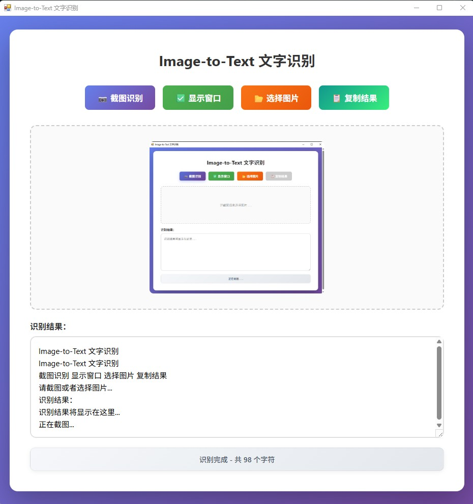

# Image-to-Text

截图或选择图片，自动识别文字并复制到剪贴板。



## 功能

- 截图识别：点击按钮进行区域截图，自动识别文字
- 图片识别：选择本地图片文件进行识别
- 一键复制：识别完成后手动点击按钮复制到剪贴板
- 显示/隐藏窗口：截图时可隐藏主窗口，避免遮挡

## 安装

```bash
pip install -r requirements.txt
```

## 使用

双击 `run-desktop.vbs` 启动应用。

首次使用需编辑 `config.ini`，填入豆包 API 配置：

```ini
[api]
api_key = 你的API_KEY
endpoint_id = 你的接入点ID
base_url = https://ark.cn-beijing.volces.com/api/v3
```

## 技术栈

- pywebview: 桌面窗口
- 豆包 Doubao-seed-2.0-pro: 文字识别
- Pillow: 图片处理

## 项目结构

```
Image-to-Text/
├── desktop_launcher.py      # 启动器
├── run-desktop.bat          # Windows 启动脚本
├── run-desktop.vbs          # 静默启动
├── requirements.txt         # 依赖
├── config.ini               # API 配置
├── preview.jpg              # 界面预览图
├── README.md
└── image_to_text/
    ├── __init__.py
    ├── web_gui.py           # 界面与截图
    ├── recognizer.py        # 豆包 API 调用
    └── clipboard.py         # 剪贴板操作
```
